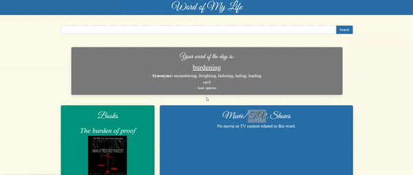

# Word of My Life

## Description

Word of My Life is a application that serves up a word of the day with media tied to that word. The user can also search up a word of their choosing to find related media. 

By merging pop culture and linguistics, we hope to inspire people to expand their vocabulary. Linguistics is a bridge to understanding history, culture, and, ultimately, people. We hope that by using this application, people will become more comfortable with new words while also learning about some potentially cool, new media.

Building this application gave us an opportunity to work with Bulma, a CSS framework, as well as multiple APIs. We were able to manipulate the response data in order to get what we need as well as error handling for missing/bad data. We learned a lot about using GitHub as a collaborative tool and finding resolutions for merge conflicts.

Why not [try it out](https://brianschapman.github.io/word-of-the-day-project/) to find a new word for your life?

## Usage

Below is a quick demonstration of the application:

## Credits

Shoutout to Ben for help us in with an API issue towards the end of the project: 

Benjamin White
